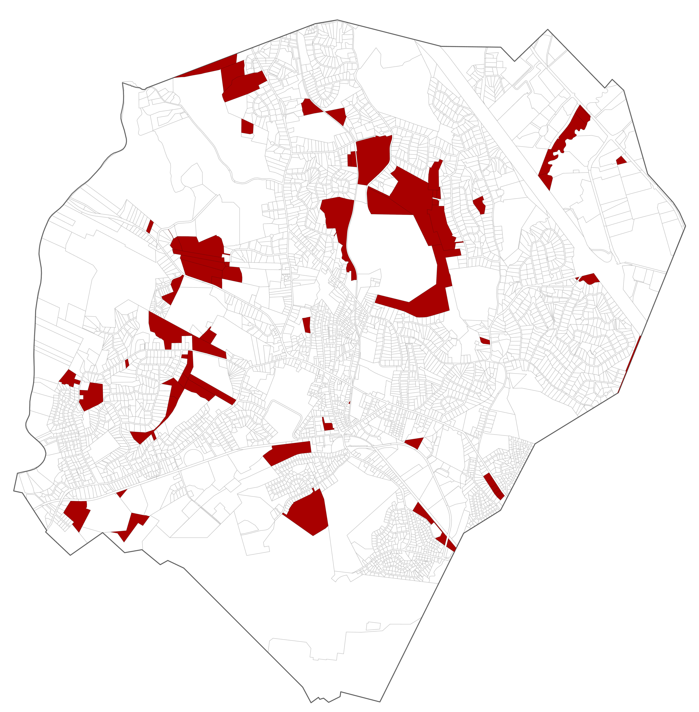
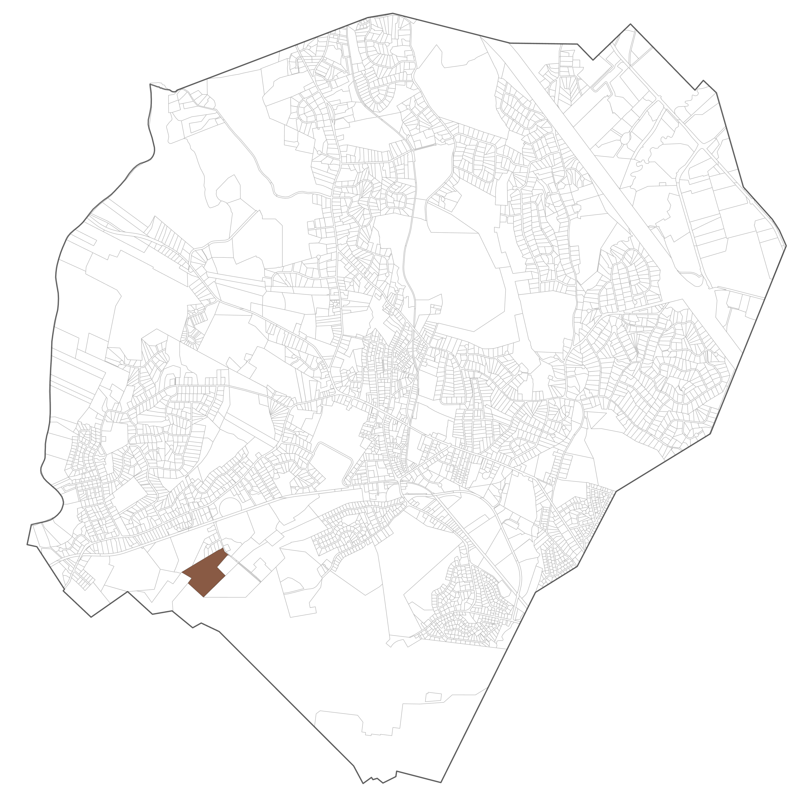
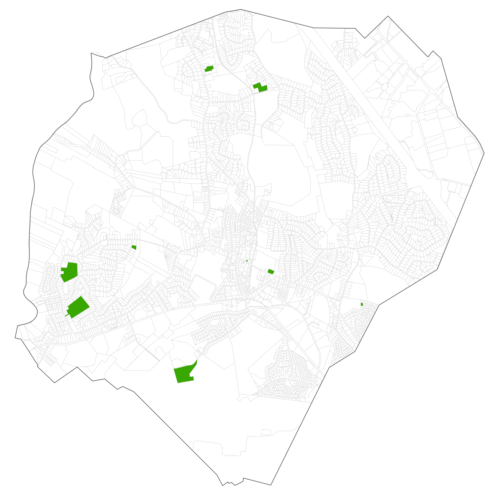
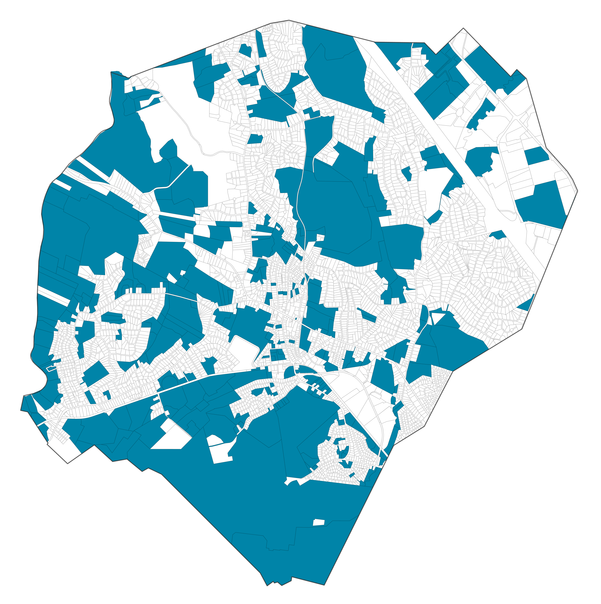
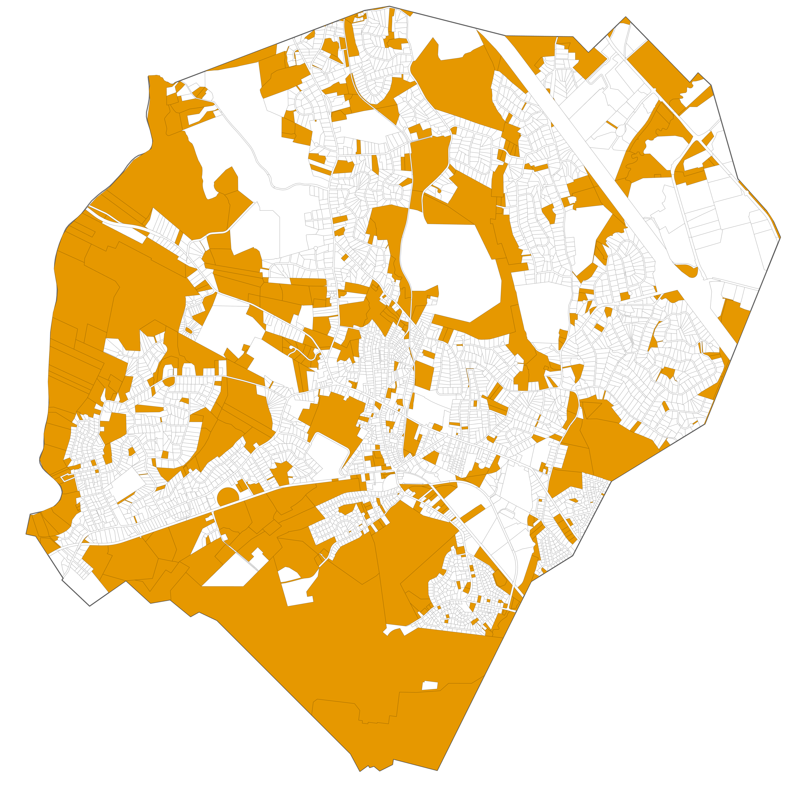
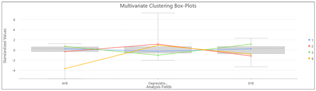
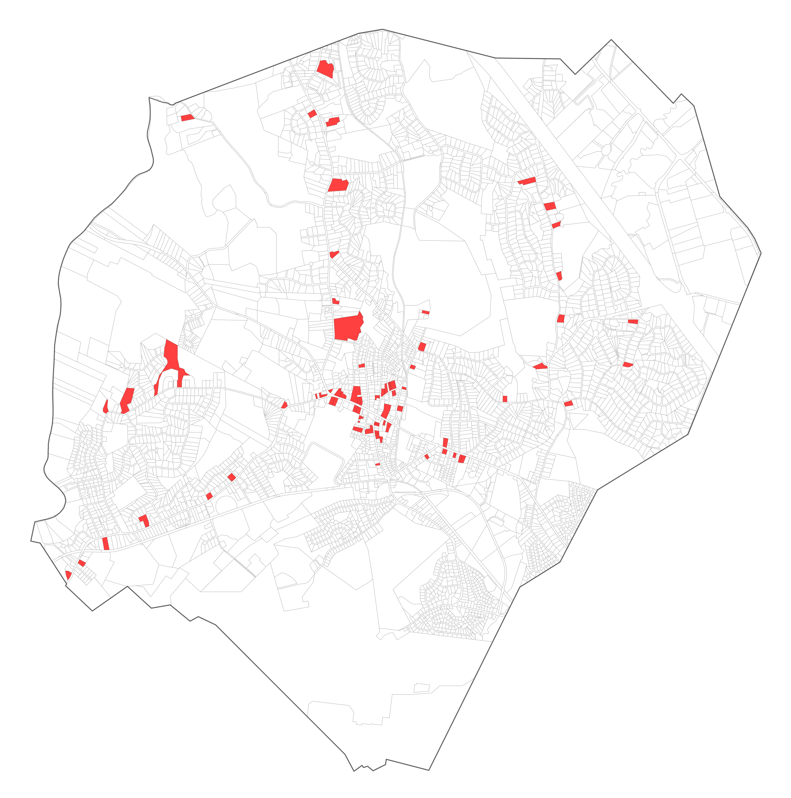

# Identifying Vacant and Potential Land for Redevelopment

Beyond the statutory requirements, identifying vacant and potentially redevelopable parcels provides important context for the Housing Growth Plan and supports suitability analysis and further analyses in subsequent phases.

This section describes queries developed to identify the parcels within these categories and a set of analytical approaches that can be used to evaluate redevelopment potential. Together, these methods offer a flexible toolkit for recognizing parcels that might support future housing development and for tailoring analyses to local priorities.

It is recommended to carefully review outputs using local knowledge, supplemental data sources, and/or aerial imagery.

For reference, the following datasets are used in the analyses:

- [Connecticut CAMA and Parcel Layer (CT Geodata Portal)](https://geodata.ct.gov/datasets/ctmaps::connecticut-cama-and-parcel-layer/about)
- [2025 Connecticut Parcel and CAMA Data (CT Open Data Portal)](https://data.ct.gov/Local-Government/2025-Connecticut-Parcel-and-CAMA-Data/rny9-6ak2/about_data)

If using aerial imagery for review, high‑resolution statewide imagery (leaf‑off, 4‑band, 3‑inch pixel) is available through CT ECO for [download](https://maps.cteco.uconn.edu/download/) or through [online services](https://maps.cteco.uconn.edu/map-services/). More information can be found on the [2023 Aerial Imagery and Elevation](https://maps.cteco.uconn.edu/data/flight2023/) web page.

<br/>

## Vacant Parcels

Vacant parcels represent land that is either currently undeveloped or previously developed but now considered vacant and may present direct development opportunities. While no statewide dataset of vacant parcels exists, the statewide CAMA and parcel dataset can be queried to identify parcels labeled as vacant.

We have completed a statewide queried feature layer as a hosted feature layer view on ArcGIS Online. This can be used as a starting point for local analysis, or a new query analysis can be started on a full CAMA and parcel dataset.

**Dataset:** [Connecticut Vacant Parcels (\*\*CT Geodata Portal)](https://ctmaps.maps.arcgis.com/home/item.html?id=1e733783ba524d26b540961257bb0bcb#overview)

::: {.callout-note appearance="simple"}
Please note that terminology is not standardized across municipalities statewide; however, many jurisdictions use similar naming conventions and descriptions that can provide useful indicators for identifying parcels that may fit within a given category.
:::

The following text-based queries were developed for the statewide parcel dataset to identify parcels that are likely vacant based on the state use code and state use description fields.

- State Use (is): "500"
- State Use Description (contains): "vac"

::: {style="text-align:center;"}
{fig-alt="Example map of vacant parcels identified" width="350"}
:::

<br/>

**Example query logic:**

``` sql
STATE_USE IS '%500%'  
OR STATE_USE_DESCRIPTION CONTAINS '%VAC%'
```

<br/>

## Potentially Redevelopable Land

Potentially redevelopable land consists of previously developed parcels with characteristics suggesting they may be underutilized or suitable for redevelopment. Consider the following approaches:

<br/>

### **Brownfields**

> Previously contaminated or industrial sites undergoing or eligible for cleanup.

The available data describing brownfield site locations is provided as an .xlsx file maintained by the Connecticut Department of Energy & Environmental Protection (DEEP).

**Dataset**: [Connecticut Brownfields Inventory](https://portal.ct.gov/deep/remediation--site-clean-up/brownfields/brownfields-site-inventory)

1.  **Spatializing the data**: Since this data is provided in a tabular format, it is necessary to spatialize it before processing with further analysis. While geocoding is feasible, it is recommended to use the Latitude and Longitude fields to create points corresponding to each brownfield site. The CRS should be NAD 83 Connecticut State Plane (2011). The following resources provide details on translating the tabular latitude and longitude data into geospatial points:

    - ArcGIS Pro: [XY Table to Point](https://doc.esri.com/en/arcgis-pro/latest/tool-reference/data-management/xy-table-to-point.html?tabs=dialog)
    - QGIS: [Create Point Layer from Table](https://qgis-tuts-wu.readthedocs.io/en/latest/land_degradation_development/interpolation/loading_table.html)

2.  Identifying brownfield parcels: Next, use the points to identify parcels that contain brownfield sites. This may be achieved with various queries, summary tools, or join tools that utilize spatial overlap. The following resources provide details and options for this process:

    - ArcGIS Pro: [Select by Location](#0), [Spatial Join](#0), [Summarize Within](#0)
    - QGIS: [Extract by Location](#0) or [Select by Location](#0) within Vector Selection, [Join Attributes by Location](#0)

::: {style="text-align:center;"}
{fig-alt="Example map of brownfield site parcels identified" width="350"}
:::

<br/>

### **Land-to-improvement value ratio**

> Analyze assessed land value to assessed improvements value in certain areas or districts to identify properties that may be underperforming (significantly higher than average land-to-improvements values)

1.  **Calculating improvement values**:

    A land-to-improvement (LTI) ratio compares a parcel’s appraised building value to the value of that parcel’s land area. Parcels with exceptionally high LTI ratios have potential for redevelopment with higher-performing structures.

    Improvement value can be found by totaling the combined appraised value of primary buildings, outbuildings (such as sheds and detached garages), and extra features (such as decks and patios). In the [Connecticut CAMA and Parcel Layer](https://geodata.ct.gov/datasets/ctmaps::connecticut-cama-and-parcel-layer/about), improvement values can be calculated by summing the “Appraised Building”, “Appraised Outbuilding”, and “Appraised Extra Feature” fields. The “Appraised Total” field should not be used in this analysis, as this field represents the combined appraised value of improvements and land.

    **Improvement** = Appraised_Building + Appraised_Outbuilding + Appraised_Extra_Feature

2.  **Calculating LTI Ratios**

    After finding the total improvement value of each parcel, a new field of land-to-improvement ratios can be calculated. Divide the “Appraised Land” field by the newly created improvement field.

    **LTI_Ratio** = Appraised_Land / Improvement

3.  **Interpreting the LTI Ratio**

    Because land and improvement values vary significantly across markets, any LTI threshold used to identify underperforming parcels should be based on local market conditions and development patterns.

```{r}
#| echo: false
#| warning: false
#| message: false
#| ft.keepnext: true

library(flextable)

lti_table <- data.frame(
  `LTI Ratio` = c("< 1.0", "= 1.0", "> 1.0"),
  `Interpretation` = c(
    "The building(s) are worth more than the land",
    "Land and structures are valued equally",
    "The land value is equal to or higher than the improvement value, redevelopment may be more likely"
  ),
  check.names = FALSE
)

flextable(lti_table) |>
  width(j = 1, width = 1.5) |>
  width(j = 2, width = 4.0) |>
  theme_vanilla() |>
  align(j = 1, align = "center", part = "all") |>
  align(j = 2, align = "left", part = "body") |>
  align(j = 2, align = "center", part = "header") |>
  valign(valign = "top", part = "all") |>
  set_table_properties(layout = "fixed") |>
  fontsize(size = 10, part = "all") |>
  padding(padding = 4, part = "all")

```

::: {style="text-align:center;"}
{fig-alt="Example map of LTI parcels identified using the applied threshold." width="350"}
:::

<br/>

### **Parcel size relative to district average**

> Analyze parcel size by neighborhood or regulatory district to identify parcels that may be underutilized (significantly larger than the average) which may indicate an opportunity for infill development

The feasibility of redevelopment efforts is also dependent on parcel size; accordingly, potentially redevelopable land analyses may include an inventory of parcels with the largest relative area within their neighborhood designation.

The “Land Acres” field in the Statewide Parcel and CAMA dataset may have missing or incomplete data so it is recommended to use the “Shape Area” field or to derive acreage directly from the parcel geometry in GIS.

- **Normalizing parcel area by neighborhood**

  To identify parcels that are larger than others in their neighborhood, an analyst should select a threshold, such as the top 10% of parcel area within each neighborhood or district, to flag potential infill opportunities.

::: {style="text-align:center;"}
{fig-alt="Example map of large parcels identified." width="350"}
:::

<br/>

### **Floor Area Ratio (FAR) analysis**

> Analyze Floor Area Ratios by neighborhood or district to identify parcels that have significantly lower than average ratios which may indicate infill or redevelopment opportunities

The floor area ratio (FAR) of a parcel’s primary building is the ratio of gross building area to lot or parcel area. Higher FAR values indicate higher building density, and lower potential for redevelopment. Whereas land-to-improvement ratio measures the economic value of existing buildings, the floor area ratio measures the physical space a building occupies, weighted by number of floors.

The [Connecticut CAMA and Parcel Layer](https://geodata.ct.gov/datasets/ctmaps::connecticut-cama-and-parcel-layer/about) field “Gross Area of Primary Building” represents the sum of all enclosed living and non-living building spaces. The gross building area is measured from a building’s exterior and factors in number of floors, extending beyond the building footprint.

In some cases, the "Gross Area of Primary Building" field may have missing or incomplete data, in which case the "Living Area" field may be used as a substitute. Note that this is a more restrictive metric, as it only captures habitable, finished floor space rather than total enclosed building area.

1.  **Calculating the FAR**

    A new field of FAR values can be calculated by dividing the “Gross Area of Primary Building” field by the parcel area field, such as the “Shape Area” field in the Connecticut CAMA and Parcel Layer.

    **FAR** = Gross Floor Area / Total Lot Area

    As previously stated, the “Shape Area” field or a parcel geometry area calculation should be used over the “Land Acres” field, as the latter may have missing or incomplete data.

2.  **Interpreting the FAR**

    Unlike land-to-improvement ratios and relative parcel size, floor area ratio and potential for redevelopment have a negative relationship: higher FAR values indicate less possibility for redevelopment.

    To identify underperforming parcels using FAR, select a threshold at the lower end of the distribution as these represent properties where the built floor area is small relative to the land area, suggesting potential for more intensive development.

```{r}
#| echo: false
#| warning: false
#| message: false
#| ft.keepnext: true

library(flextable)

far_table <- data.frame(
  `FAR Ratio` = c("< 1.0", "= 1.0", "> 1.0"),
  `Interpretation` = c(
    "The building's total square footage is smaller than the lot. This indicates low-density development, such as single-family homes or suburban subdivisions.",
    "The total building size is exactly equal to the lot size. This means you could build a one-story building covering the entire lot, or a two-story building covering half the lot.",
    "The building space exceeds the lot size, indicating multi-story, high-density development. For example, a 10-story building occupying 10% of a lot yields a high FAR."
  ),
  check.names = FALSE
)

flextable(far_table) |>
  width(j = 1, width = 1.5) |>
  width(j = 2, width = 4.0) |>
  theme_vanilla() |>
  align(j = 1, align = "center", part = "all") |>
  align(j = 2, align = "left", part = "body") |>
  align(j = 2, align = "center", part = "header") |>
  valign(valign = "top", part = "all") |>
  set_table_properties(layout = "fixed") |>
  fontsize(size = 10, part = "all") |>
  padding(padding = 4, part = "all")

```

::: {style="text-align:center;"}
{fig-alt="Example map identifying parcels based on low FAR values." width="350"}
:::

<br/>

### **Construction and renovation year clustering**

> Analyze construction and renovation years to identify clusters of existing units in need of rehabilitation.

Construction and renovation year clustering offers insight into building aging patterns within municipalities, with the goal of identifying parcel clusters that may need rehabilitation.

The [Connecticut CAMA and Parcel Layer](https://geodata.ct.gov/datasets/ctmaps::connecticut-cama-and-parcel-layer/about) has multiple fields relevant to this analysis.

- “AYB” (Actual Year Built) field: The original construction date for each parcel’s primary building
- “EYB” (Effective Year Built) field: The building’s effective age, factoring in remodeling and renovations.
- “Depreciation” field: Percent values indicating the amount of depreciation a building has experienced.

It is important to note that there are no statewide criteria for evaluating Effective Year Built. The calculation of effective building age may vary depending on the individual judgement of assessors and is a form of subjective data. Accordingly, if the AYB and EYB fields lack sufficient data or if municipalities have their own criteria for evaluating EYB, they may elect to use their own assessor data and property records.

1.  **Construction and renovation year clustering analysis**

    This analysis uses a multivariate clustering tool in GIS to group parcels based on three fields simultaneously: original construction date (AYB), effective building age (EYB), and physical deterioration (Depreciation). Rather than applying a single threshold to one variable, multivariate clustering evaluates all three fields at once, automatically grouping parcels that share similar combinations of age, renovation history, and condition. The result is multiple groups of parcels, one of which will represent the oldest, least-renovated, and most deteriorated buildings in the study area, which are the parcels most likely to be candidates for rehabilitation or redevelopment

    **Why multivariate clustering?**

    A simple threshold approach (for example, filtering only by construction year) would miss properties that are old but have been well-maintained, or flag properties that are deteriorated but have been recently renovated. A multivariate analysis using the "AYB", "EYB", and "Depreciation" fields together can be used to flag groups of parcels with high redevelopment potential.

    It is also important to use a clustering method that does not rely on spatial relationships between parcels, meaning one that groups parcels based purely on shared traits rather than proximity or adjacency. Spatial clustering methods, such as K-nearest neighbor (KNN) or Queen contiguity, which would traditionally be used for parcel data using polygon geometry, identify parcels based on how close they are to each other or whether they share edges or corners. Because the parcel layer may be segmented by missing data, these methods will fail or produce inaccurate clusters by attempting to connect parcels across large gaps. Instead, a non-spatial multivariate clustering tool ensures that all parcels with available data are assigned to a cluster with shared features, regardless of where they are located. For more insight into these methods and their limitations:

    - Brief introduction to concepts, with R examples: [Spatial Weights Matrix](https://cran.r-project.org/web/packages/geostan/vignettes/spatial-weights-matrix.html)
    - Description of spatial statistics: [Modeling Spatial Relationships](https://doc.esri.com/en/arcgis-pro/latest/tool-reference/spatial-statistics/modeling-spatial-relationships.html)
    - Overview of ESRI clustering tools and their applications: [Mapping Clusters](https://doc.esri.com/en/arcgis-pro/latest/tool-reference/spatial-statistics/an-overview-of-the-mapping-clusters-toolset.html)

    Instead, it is recommended to use a multivariate clustering tool that relies only on the presence of shared traits. These tools identify optimized seed locations, or initial parcels, by maximizing their initial distance from each other, then repeatedly adjust these seeds to minimize variability within clusters and increase variability between clusters. In this way, all parcels with available data are assigned to a cluster with shared features. Simplified, the process is:

    ::: {}
    *assign seeds → recompute and adjust seed location → repeat until stable*
    :::

    The following tools and settings are recommended for conducting this analysis in GIS software:

    - ArcGIS Pro: [Multivariate Clustering](https://doc.esri.com/en/arcgis-pro/latest/tool-reference/spatial-statistics/multivariate-clustering.html?tabs=dialog)
    - QGIS: [Attribute Based Clustering Plugin](https://knowyourspace.dk/2021/04/09/using-the-attribute-based-clustering-plugin-qgis/)

    Recommended settings:

    - K-means algorithm
    - 4 seeds (producing 4 clusters)
    - Optimized seeds

    For the ArcGIS Pro tool, there is an option to choose between the K-means or K-medoids algorithm. K-medoids is robust to outliers, while K-means is faster and operates more efficiently with large datasets; accordingly, K-means is the recommended algorithm for this analysis and is also the default option for the QGIS Attribute Based Clustering Plugin.

2.  **Data preparation**

    Within the Statewide Parcel and CAMA data, the AYB and EYB fields may include null placeholder values of 0, 15, or other extremely low numbers. Placeholders may also take the form of years from the 1500s, 1600s, or 1700s. Accordingly, municipalities should evaluate the distribution of AYB values in their CAMA data, identify any outliers or apparent null placeholders, verify these against their oldest historical buildings, and filter this data out prior to running the clustering analysis.

    Example filter queries include:

    - "EYB" is not equal to 0
    - "AYB" is greater than or equal to 1639 (the construction year of the Henry Whitfield House, the oldest standing building in Connecticut)
    - "AYB" \>= 1788 (the year of Connecticut's founding as a state)
    - "AYB" \>= 1899 (a common placeholder year, as it is the zero date in systems like SQL, Power BI, and SharePoint)

3.  Interpreting results

    Below is a sample series of boxplots automatically produced by running the Multivariate Clustering tool in ArcGIS Pro. These boxplots illustrate the distribution of data for the three fields of interest and reveal which clusters contain the combination of traits most relevant to this analysis. The target cluster will exhibit the lowest AYB, lowest EYB, and highest depreciation percentage.

    ::: {style="text-align:center;"}
    {fig-alt="multivariate clustering box plot example" width="800"}
    :::

    For example, the yellow cluster (cluster 4) contains parcels with extremely low AYB, high depreciation percentage, and low EYB, while the red cluster (cluster 2) contains parcels with low AYB, the highest depreciation, and the lowest EYB. Accordingly, clusters 2 and 4 are groups of interest for potential rehabilitation; in this case, cluster 2 would be isolated and included in a Potentially Redevelopable Land inventory, as it has the highest depreciation and lowest EYB.

    Note that AYB will naturally contain lower values than EYB, as it reflects original construction rather than effective age. The oldest buildings may have already undergone extensive renovation and therefore may not exhibit similarly extreme Depreciation or EYB values. Accordingly, Depreciation and EYB should be weighted more heavily when deciding which cluster to isolate, as these variables better reflect the current physical condition of properties.

    The figure on the left (a) shows the results of the Multivariate Clustering tool in ArcGIS Pro, where cluster colors on the map correspond to those shown in the boxplots. The figure on the right (b) shows the resulting map after isolating cluster 2, which represents the end product of a construction and renovation year clustering analysis.

::: {style="text-align:center;" layout-ncol="2"}
{fig-alt="multivariate clustering box plot example" width="300"}

{fig-alt="multivariate clustering box plot example" width="300"}
:::